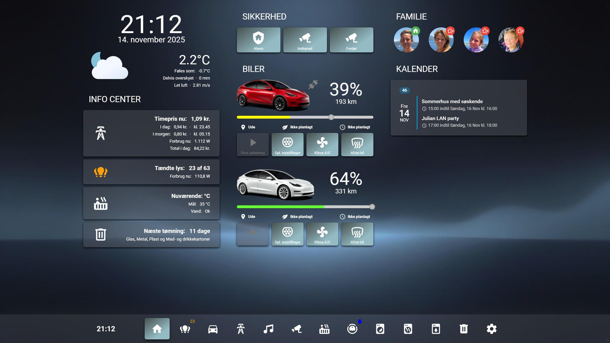
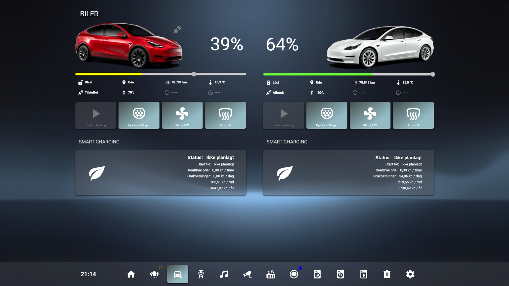
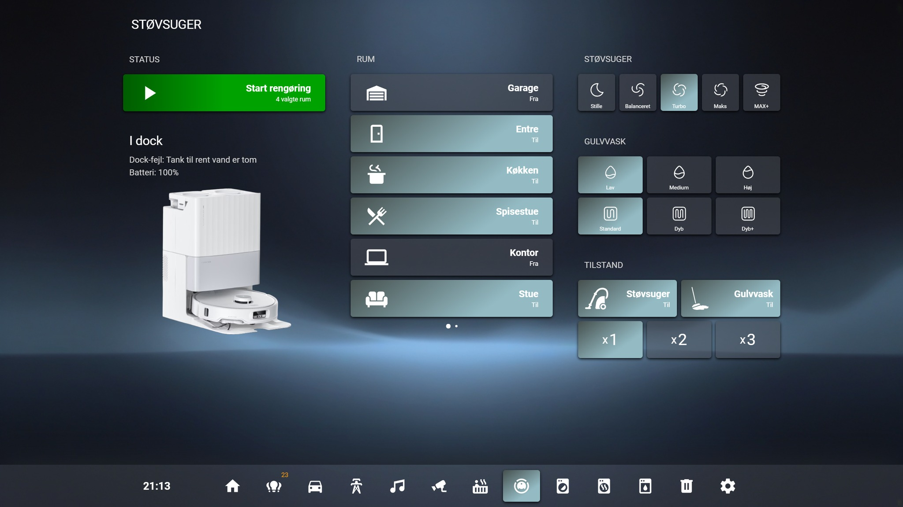

# 🏠 Home Assistant Fixed Menu Bar (Clock + 5 Items)

A reusable, fixed-position navigation bar for **Home Assistant Lovelace dashboards** — featuring a live clock, 5 customizable icons, and active view highlighting.

This setup uses a **single shared template** defined in the dashboard’s raw YAML configuration and a **tiny per-view card** that only specifies the current view’s path.

---

## ⚙️ Requirements

This setup requires the following **HACS frontend integrations**:

| Integration | Purpose | Why It’s Needed |
|--------------|----------|-----------------|
| **kiosk_mode** | Hides the Home Assistant header and sidebar. | Prevents overlap with the fixed menu bar and gives a full-screen look. |
| **decluttering-card** | Lets you define reusable templates. | So you can use the same menu on multiple views without duplicating code. |
| **button-card** | Creates the interactive buttons and clock. | Each icon in the menu is a button-card element. |
| **card-mod** | Allows applying CSS styling to cards. | Used to fix the bar position, apply shadows, colors, and layout. |

> 💡 Make sure all are installed and visible under **Settings → Dashboards → Resources**.

---

## 🧱 Step 1 – Add the Menu Template

You’ll create a reusable template that defines the menu bar, icons, paths, and styling.

### 🪄 How to Add It

1. Go to your dashboard  
   → Click **⋮ (three dots)** → **Edit Dashboard**  
   → Click **⋮ (three dots)** again → **Raw configuration editor**  
2. Paste the YAML code below.  
   If you already have a `decluttering_templates:` section, just add this under it.

```
# ============================================
# Fixed Bottom/Top Menu Bar (Clock + 5 Items)
# Dependencies: kiosk_mode, decluttering-card, button-card, card-mod
# ============================================

decluttering_templates:
  bottom-menu-fixed:
    default:
      # ---------- Global settings ----------
      - time_entity: sensor.time   # Time source for the clock

      # ---------- Menu items (edit icons & paths here) ----------
      - item1_icon: mdi:home
      - item1_path: /lovelace/home

      - item2_icon: mdi:lightbulb-group
      - item2_path: /lovelace/lights

      - item3_icon: mdi:car
      - item3_path: /lovelace/car

      - item4_icon: mdi:music
      - item4_path: /lovelace/music

      - item5_icon: mdi:cog
      - item5_path: /lovelace/system

    card:
      type: custom:mod-card
      card_mod:
      class: bottom-menu
        style: |
          :host(.bottom-menu) {
            /* --- Positioning --- */
            position: fixed;
            z-index: 2;
            bottom: 0;               /* Change to top: 0; for top placement */
            right: 0;
            width: calc(100% - 20px);
            padding: 10px;
            margin: 0 !important;

            /* --- Layout --- */
            display: flex;
            justify-content: center;  /* Options: start | center | end */

            /* --- Style --- */
            background: rgba(25, 25, 25, 0.6);
            box-shadow: 0 0 60px rgb(34,37,42);
            border-radius: 16px;
            backdrop-filter: blur(6px);
          }

      card:
        type: horizontal-stack
        cards:

          # ---------- Clock ----------
          - type: custom:button-card
            tap_action:
              action: none
            styles:
              card:
                - width: 100px
                - height: 60px
                - position: relative
                - background: none
                - box-shadow: none
                - border-radius: 16px
              custom_fields:
                time:
                  - position: absolute
                  - top: 50%
                  - left: 50%
                  - transform: translate(-50%, -50%)
                  - font-size: 20px
                  - font-weight: bold
            custom_fields:
              time: |
                [[[
                  const ent = '[[time_entity]]';
                  return states[ent]?.state ?? '';
                ]]]

          # ---------- Item 1 ----------
          - type: custom:button-card
            icon: '[[item1_icon]]'
            tap_action:
              action: navigate
              navigation_path: '[[item1_path]]'
            styles:
              card:
                - width: 70px
                - height: 60px
                - border-radius: 16px
                - justify-content: center
                - align-items: center
                - background: |
                    [[[
                      return ('[[active_path]]' === '[[item1_path]]')
                        ? 'rgba(255,255,255,0.09)'
                        : 'none';
                    ]]]
              icon:
                - width: 34px
                - height: 34px
                - color: |
                    [[[
                      return ('[[active_path]]' === '[[item1_path]]')
                        ? '#fff'
                        : 'rgba(255,255,255,0.65)';
                    ]]]

          # ---------- Item 2 ----------
          - type: custom:button-card
            icon: '[[item2_icon]]'
            tap_action:
              action: navigate
              navigation_path: '[[item2_path]]'
            styles:
              card:
                - width: 70px
                - height: 60px
                - border-radius: 16px
                - justify-content: center
                - align-items: center
                - background: |
                    [[[
                      return ('[[active_path]]' === '[[item2_path]]')
                        ? 'rgba(255,255,255,0.09)'
                        : 'none';
                    ]]]
              icon:
                - width: 34px
                - height: 34px
                - color: |
                    [[[
                      return ('[[active_path]]' === '[[item2_path]]')
                        ? '#fff'
                        : 'rgba(255,255,255,0.65)';
                    ]]]

          # ---------- Item 3 ----------
          - type: custom:button-card
            icon: '[[item3_icon]]'
            tap_action:
              action: navigate
              navigation_path: '[[item3_path]]'
            styles:
              card:
                - width: 70px
                - height: 60px
                - border-radius: 16px
                - justify-content: center
                - align-items: center
                - background: |
                    [[[
                      return ('[[active_path]]' === '[[item3_path]]')
                        ? 'rgba(255,255,255,0.09)'
                        : 'none';
                    ]]]
              icon:
                - width: 34px
                - height: 34px
                - color: |
                    [[[
                      return ('[[active_path]]' === '[[item3_path]]')
                        ? '#fff'
                        : 'rgba(255,255,255,0.65)';
                    ]]]

          # ---------- Item 4 ----------
          - type: custom:button-card
            icon: '[[item4_icon]]'
            tap_action:
              action: navigate
              navigation_path: '[[item4_path]]'
            styles:
              card:
                - width: 70px
                - height: 60px
                - border-radius: 16px
                - justify-content: center
                - align-items: center
                - background: |
                    [[[
                      return ('[[active_path]]' === '[[item4_path]]')
                        ? 'rgba(255,255,255,0.09)'
                        : 'none';
                    ]]]
              icon:
                - width: 34px
                - height: 34px
                - color: |
                    [[[
                      return ('[[active_path]]' === '[[item4_path]]')
                        ? '#fff'
                        : 'rgba(255,255,255,0.65)';
                    ]]]

          # ---------- Item 5 ----------
          - type: custom:button-card
            icon: '[[item5_icon]]'
            tap_action:
              action: navigate
              navigation_path: '[[item5_path]]'
            styles:
              card:
                - width: 70px
                - height: 60px
                - border-radius: 16px
                - justify-content: center
                - align-items: center
                - background: |
                    [[[
                      return ('[[active_path]]' === '[[item5_path]]')
                        ? 'rgba(255,255,255,0.09)'
                        : 'none';
                    ]]]
              icon:
                - width: 34px
                - height: 34px
                - color: |
                    [[[
                      return ('[[active_path]]' === '[[item5_path]]')
                        ? '#fff'
                        : 'rgba(255,255,255,0.65)';
                    ]]]

```

## 🧩 Step 2 – Add the Menu to Each View

Add a tiny card on **each view** that should show the menu.  
This card points to the shared template and tells it which page is currently active.

```yaml
type: custom:decluttering-card
template: bottom-menu-fixed
variables:
  - active_path: /lovelace/home   # MUST match this view’s URL path exactly
```

### 🔍 How to find your path
Open the view in your browser and look at the URL after your Home Assistant address.  
Example: `http://your-ha.local:8123/lovelace/lights` → the path is `/lovelace/lights`.

Repeat this for each view, changing only the `active_path`.

## 🎨 Step 3 – Customize the Look

Tweak the visual style directly in the template’s `card_mod: style` block.

- **Top or bottom bar:** change `bottom: 0;` to `top: 0;`
- **Alignment:** set `justify-content:` to `start`, `center`, or `end`
- **Colors:** adjust `background:` (e.g., `rgba(25,25,25,0.6)`)
- **Shadow:** change `box-shadow:` (e.g., `0 0 60px rgb(34,37,42)`)
- **Rounded corners:** tweak `border-radius:` (e.g., `16px`)
- **Glass effect:** modify `backdrop-filter:` (e.g., `blur(6px)`)

> Tip: If your bar overlaps HA’s header/sidebar, enable **kiosk_mode** to hide them or move the bar to the **top**.


## ➕ Step 4 – Add More Menu Items

You can add more than 5 items by duplicating an item block in the template.

1) **Add defaults** for the new item in the `default:` list:

```yaml
- item6_icon: mdi:shield-home
- item6_path: /lovelace/security
```

2) **Duplicate** one of the “Item X” button blocks under `cards:` and update the references inside it to `item6_icon` and `item6_path`.

> You don’t need to change your per-view card unless you want different icons/paths per view. The menu uses the defaults you set in the template.


## 🧯 Troubleshooting

| Issue | Possible Fix |
|------|---------------|
| Bar overlaps header or sidebar | Enable **kiosk_mode** or move the bar to the **top** (`top: 0;`). |
| Active icon doesn’t highlight | Make sure `active_path` **exactly** matches the current view URL (e.g., `/lovelace/lights`). |
| Styles not applying | Confirm **card-mod** is installed and loaded in **Resources**; hard refresh the browser (Ctrl/Cmd + Shift + R). |
| Icons not showing | Ensure **button-card** is installed and added in **Resources**. |
| Decluttering not found | Ensure **decluttering-card** is installed and added in **Resources**. |
| Menu not visible on a view | Add the Step 2 per-view card and set the correct `active_path`. |


## ✅ Done!

You now have a clean, reusable, fixed navigation bar with a live clock and customizable icons.  
Edit icons/paths once in the template; on each view, you only pass `active_path`.

Happy dashboarding! 🎉




